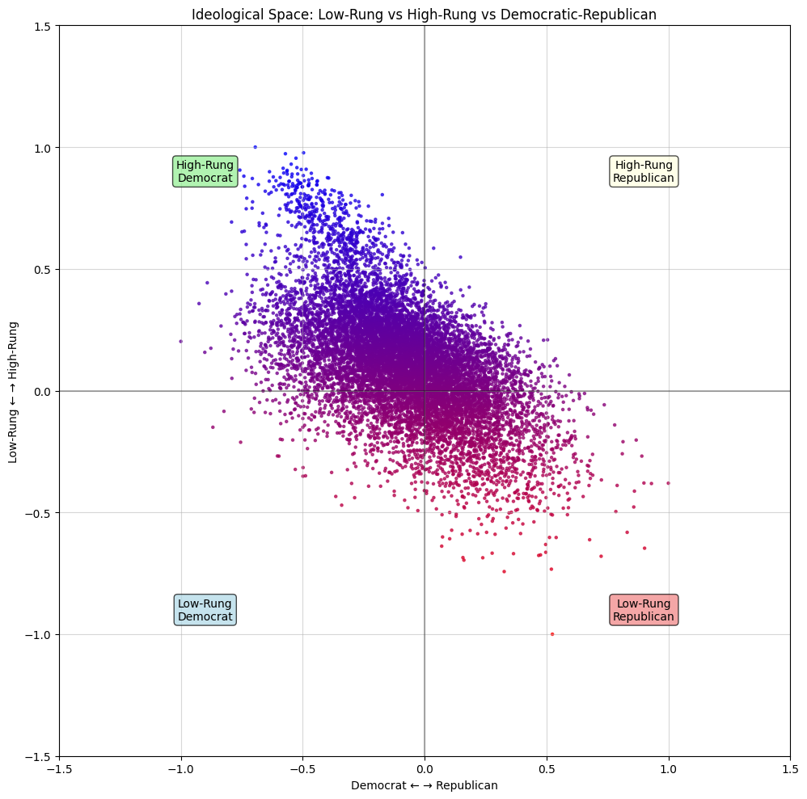
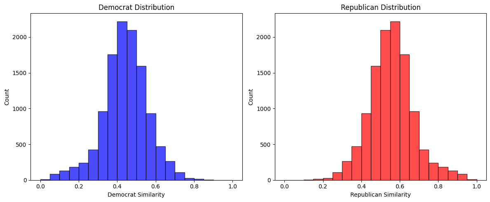

# I mapped 11,000 Reddit comments to see where they fall on a political & thinking-style map

Each dot represents a **real comment** from `/r/politics` and is placed based on linguistic similarity — how closely it matches patterns I've labeled.

| Color | Language more like |
|-------|---------|
| 🟥 **Red** | `Build the wall`, `Stop the steal`, `Taxation is theft` |
| 🟦 **Blue** | `Healthcare is a human right`, `Black Lives Matter`, `Tax the rich` |
| ⬆️ **High-Rung** | `What's the best argument against my view?`, `I might be wrong`, `Let's define our terms` |
| ⬇️ **Low-Rung** | `If you're not with us, you're against us`, `They always lie`, `You can't trust those people` |

## ⚠️ A Word of Caution ⚠️

Don't be an idiot about this map. This visualization does **NOT** tell you who's smarter, better, or more "correct." It doesn't rank people's worth, and it sure as hell doesn't justify treating those who think differently as stupid or evil. If that's what you're here for, you've already lost the plot

Culture-war identity markers are crudely over-simplified. Politics is broken, and that really scares me. So I often think about how we can do better.To win together as humanity. This repo is part of my musings on the topic.

## Inspiration

Tim Urban's concepts of **"high rung"** and **"low rung"** are part of his **"Thinking Ladder"** framework. This describes not just *what* people believe, but *how* they arrive at and think about those beliefs. The vertical dimension complements the traditional left-right ("horizontal") ideological spectrum.

The book: [What's Our Problem?](https://waitbutwhy.com/whatsourproblem) by [Tim Urban](https://waitbutwhy.com)

## Technical Details

### Data Processing
- **Dataset**: [Politics on Reddit](https://www.kaggle.com/datasets/gpreda/politics-on-reddit) by Gabriel Preda
- **Preprocessing**: Normalize whitespace, remove tabs/newlines, keep only 20-200 characters long comments

### Embedding Generation
- **Model**: Fine-tuned BERT (`bert-base-uncased`) - 110M parameters
- **Normalization**: L2 normalization for cosine similarity calculations

### Ideological Axes
- Made up 20 representative phrases (20 phrases per axis)
- Used difference vector between means of embeddings

### Technical Stack
- **ML**: PyTorch, Transformers, scikit-learn
- **Data**: Pandas, NumPy
- **Visualization**: Matplotlib
- **Caching**: SQLite

*Made by* [*Tigor* 🐯](https://tigor.net) 